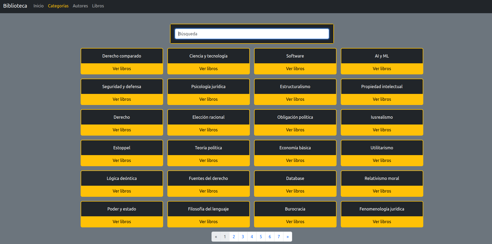

# Biblioteca 
###### Simple personal app storing digital books (pdf, epub, djvu) filtering by authors and categories
###### Created with Django and Bootstrap
#### Add books:
###### The manage.py comand "add_books" store all the books contained in the folder "/media/authors_folder"
###### Within that folder should be contained a folder for each author
###### To correctly store books, authors and categories the files should be stored with the following format:
###### authors_folder/{author1} - {author2}/{book_title} @{category1} @{category2}.{file_format}
###### Folder example:

##### Homepage:

##### Categories:

##### Authors:

##### Books:

